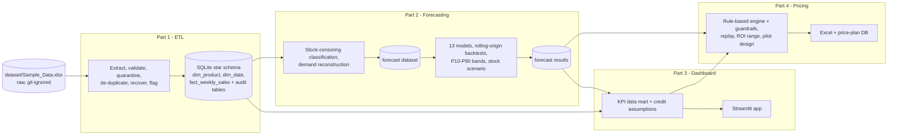

# Armani Middle East Trading – Data Science Technical Assessment

End-to-end solution for the four parts of the assessment: **ETL and database**, **26-week demand forecasting**, **KPI dashboard**, **dynamic pricing and risk strategy**. Every part is a Jupyter notebook; each notebook creates its own output folder (same name as the notebook) with an Excel workbook of all results.

## Results at a glance

| Part | Deliverable | Headline result |
|---|---|---|
| 1 – Data engineering | `part1_etl_pipeline_v1.1.ipynb` → SQLite star schema | 7,839 raw rows → 7,800 clean product-weeks (39 exact duplicates dropped, 16 missing sales recovered, 0 rows quarantined); every correction logged |
| 2 – Forecasting | `part2_preprocessing_v1.0.ipynb`, `part2_forecasting_v1.1.ipynb` | 13 models compared on 4 rolling-origin backtests; selected *shared-curve structural model*: **WAPE 4.57 %** (MAE 97 units, MAPE 5.03 %) vs 5.28 % for the best baseline and ~34 % worse for seasonal naive |
| 3 – Dashboard | `part3_dashboard_v1.0.ipynb` → Streamlit app | 8 tabs (executive, financial, operations, credit, forecast, drill-down, alerts, about); 24 automated tests |
| 4 – Pricing | `part4_pricing_v1.0.ipynb` | 780 recommended prices (30 products × 26 weeks); +$1.3 M profit over 26 weeks in the planning case, positive across every sensitivity tested; 19 automatic checks |

## The key finding that shapes the whole solution
`Sales_Units` is **capped by the stock available** (`sales = min(demand, stock)`), and the stock a week can sell from is the *previous* row's inventory. About 53 % of product-weeks are stock-limited or out of stock, so observed sales understate demand. Part 1 flags these weeks, Part 2 reconstructs demand and forecasts **demand** (not sales), Part 3 reports lost demand and service level, and Part 4 prices on scarcity.

## Architecture



Each arrow is a file produced by one notebook and read by the next; nothing is passed in memory.

## Repository structure

```
part1_eda_v1.1.ipynb, part1_eda_v1.2.ipynb      raw-data EDA (read-only)
part1_etl_pipeline_v1.0.ipynb, ..._v1.1.ipynb   ETL pipeline and database
part2_preprocessing_v1.0.ipynb                  stock censoring and demand reconstruction
part2_forecasting_v1.0.ipynb, ..._v1.1.ipynb    model comparison and 26-week forecast
part3_dashboard_v1.0.ipynb                      builds, tests and documents the dashboard
part3_dashboard_v1.0/                           deployable app: dashboard_app_v1.0.py, dashboard_data_v1.0.db,
                                                requirements.txt, RUN_DASHBOARD_v1.0.md
part4_pricing_v1.0.ipynb                        pricing framework (rulebook in Section 2)
part4_pricing_v1.0/pricing_rulebook_v1.0.docx   Word document: the pricing rules and algorithmic logic (Part 4 documentation deliverable)
CHANGELOG.md                                    every version and what changed
requirements.txt                                environment for all notebooks
dataset/                                        put Sample_Data.xlsx here (git-ignored)
```
The SQL schema is written by the ETL notebook to `part1_etl_pipeline_v1.1/schema_v1.1.sql` when it runs. Generated output folders (`part*_*/`) are git-ignored, except the files the dashboard needs for deployment.

**Versioning:** every file starts with its part (`part1_`) and ends with its version (`_v1.1`). A new version is a new notebook; older notebooks stay as history (see `CHANGELOG.md`).

## Setup and how to run

```bash
python -m venv .venv && source .venv/bin/activate        # Windows: .venv\Scripts\activate
pip install -r requirements.txt
mkdir -p dataset && cp /path/to/Sample_Data.xlsx dataset/   # raw data is not committed
```

Run the notebooks **from the repository root, in this order** (each needs the previous outputs):

```bash
jupyter nbconvert --to notebook --execute --inplace part1_etl_pipeline_v1.1.ipynb
jupyter nbconvert --to notebook --execute --inplace part2_preprocessing_v1.0.ipynb
jupyter nbconvert --to notebook --execute --inplace part2_forecasting_v1.1.ipynb   # longest step (Prophet, LightGBM, backtests)
jupyter nbconvert --to notebook --execute --inplace part3_dashboard_v1.0.ipynb
jupyter nbconvert --to notebook --execute --inplace part4_pricing_v1.0.ipynb
```
(or open them in Jupyter and *Run All*). `part1_eda_*` and the older versions are independent and optional. The Part 3 notebook takes dashboard screenshots with Playwright, so run `playwright install chromium` once before it (the app itself does not need Playwright).

**Dashboard only:** `pip install -r part3_dashboard_v1.0/requirements.txt` then `streamlit run part3_dashboard_v1.0/dashboard_app_v1.0.py`. Deployment steps for Streamlit Community Cloud are in `part3_dashboard_v1.0/RUN_DASHBOARD_v1.0.md`.

## Part-by-part summary

**Part 1 – ETL.** Extract with file and schema checks, untouched copy in `stg_sales_raw`; exact duplicates removed, missing sales recovered as `revenue / price`, infinite growth values nulled, derived columns (revenue, gross profit, margin) recomputed; typed exceptions and a quarantine table for corrupt rows; the load is one idempotent transaction. Star schema: `dim_product`, `dim_date`, `fact_weekly_sales`, plus `data_quality_log`, `quarantine_rows`, `etl_run_log`. A scorecard and validation tests close the notebook.

**Part 2 – Forecasting.** Target is reconstructed weekly demand: observed sales when stock did not limit them, otherwise `max(sales, blend of the legacy forecast and a seasonal model)` (blend weight 0.40, tuned out-of-fold). Models: three baselines, Holt-Winters, SARIMAX with Fourier terms, structural pooled / per segment, LightGBM global / per segment, Prophet, two ensembles, plus a plain "Size × Season × Growth" recipe (4.72 % WAPE). All free parameters are tuned on training windows only. Primary metric WAPE; MAE, RMSE, MAPE, MASE and bias are reported; paired bootstrap for significance; P10–P90 bands from backtest ratios (80 % coverage). Factors: one shared seasonal curve (swing 1.67×), product level, growth about 2.8 % a year; price has no measurable effect.

**Part 3 – Dashboard.** Financial (gross margin, revenue growth, operating profit), operational (inventory turnover, DSI, service level, lost revenue) and credit KPIs (DSO, A–E default-risk rating), historical trends, 26-week forecast with P10–P90 band, and rule-based alerts (stock-out, overstock, margin, revenue, credit) with drill-down from company to category to product.

**Part 4 – Pricing.** Price follows scarcity and season: a scarcity premium (≤ +8 %), a sell-out protection check, a profit-tested markdown rule for surplus stock, a credit-risk rule (no discounts and a risk premium for D/E), and guardrails (cost floor, −8 % / +10 % competitive band, ±3 % weekly step). The written rules are in `part4_pricing_v1.0/pricing_rulebook_v1.0.docx` (also Section 2 of the notebook). The notebook contains the 26-week plan, a 52-week replay without look-ahead, the money impact as a range over price sensitivity, sensitivity analyses (including the risk that reconstructed demand is too high), stock and credit actions, and a pilot design.

## Key assumptions

1. **Calendar:** the dataset has week numbers only; a synthetic weekly calendar starting 2020-01-06 is used. Seasonal findings (e.g. "peak in week 13") are relative to that calendar.
2. **Stock timing:** sales in week *t* are limited by the previous row's inventory (verified: 0 rows violate it after the correction).
3. **Demand:** in stock-limited weeks demand is reconstructed, so forecast accuracy on those weeks is an estimate; the honest accuracy figure is the WAPE on directly observed (unconstrained) weeks, 6.6 %.
4. **Future stock:** unknown; simulated from each product's own last 104 weeks of stock history.
5. **Prices and costs:** the forecast period uses the last-13-week average price and cost.
6. **Credit data:** the dataset has no customers, invoices or terms, so DSO, default risk and the credit rating are driven by **editable assumptions** per category (terms, share on credit, payment delay, default rate), labelled as such in the dashboard and in Part 4.
7. **Price sensitivity:** not estimable (prices vary about 4 % within a product; the estimated effect is −0.017 with a 95 % range of −0.056 to +0.021). Part 4 therefore shows results for sensitivities from 0 to −3 and proposes a pilot.
8. **Competitors:** no competitor prices; the 13-week average price ± a band is the proxy.
9. **Holding and funding costs:** 12 % and 8 % a year (assumptions).

## Limitations and next steps
- Credit ratings and pricing sensitivity rest on assumptions until real customer and price-test data exist (Part 4, Section 11, designs the pilot).
- The pricing engine is per product-week; customer- or channel-level pricing needs customer data.
- A "Pricing" tab in the dashboard would be a natural next version (`part3_dashboard_v1.1`).

## Note on AI assistance
This project was developed with an AI coding assistant (Claude Code). All analysis choices, assumptions and results are documented in the notebooks and `CHANGELOG.md` and were checked by running the code.
